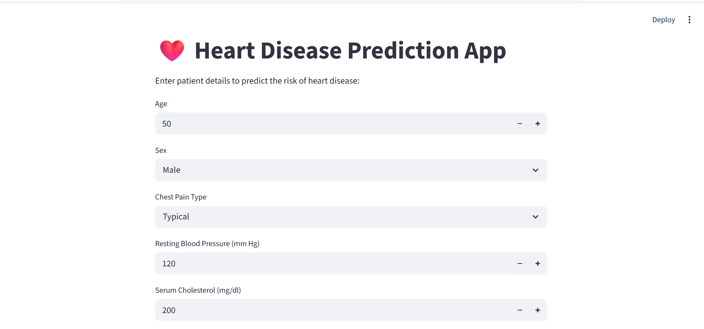

# ❤️ Heart Disease Prediction App

[](https://www.python.org/)
[](https://streamlit.io/)
[](https://scikit-learn.org/)
[](https://www.docker.com/)
[](LICENSE)

---

## 🧠 Overview
The **Heart Disease Prediction App** is a machine learning web application that predicts the likelihood of heart disease based on medical and clinical parameters.

It uses a trained ML model and provides real-time predictions through a simple and interactive Streamlit interface.

---

## 🚀 Live Demo
Check the live app here: [Hugging Face Demo](https://huggingface.co/spaces/laila123younas/cardio-predictor)
## 📸 App Preview


<!-- PUT YOUR SCREENSHOTS HERE -->



---


## 🔗 Run Locally

### 1️⃣ Clone Repository

```
git clone <your-repo-link>
cd Heart-Disease-Prediction-App
```

---

### 2️⃣ Create Virtual Environment

```
python -m venv venv

# Windows
venv\Scripts\activate

# Mac/Linux
source venv/bin/activate
```

---

### 3️⃣ Install Dependencies

```
pip install -r requirements.txt
```

---

### 4️⃣ Run App

```
streamlit run app.py
```

---

## 🌐 Access URLs (After Running)

* 🖥 Local URL: [http://localhost:8501](http://localhost:8501)
* 🌐 Network URL: [http://192.168.10.14:8501](http://192.168.10.14:8501)

---

## ☁️ Hugging Face Deployment

This app is deployed on Hugging Face Spaces:

👉 [https://huggingface.co/spaces/laila123younas/cardio-predictor](https://huggingface.co/spaces/laila123younas/cardio-predictor)

Steps:

* Upload project files
* Add requirements.txt
* Hugging Face auto-builds app
* Get public URL instantly

---

## 🐳 Docker Deployment (Optional)

```
docker build -t heart-disease-app .

docker run -p 8501:8501 heart-disease-app
```

---

## 📂 Project Structure

```
Heart-Disease-Prediction-App/
│
├── app.py
├── train_model.py
├── heart.csv
├── model.pkl
├── scaler.pkl
├── encoder.pkl
├── requirements.txt
├── Dockerfile
└── assets/
    ├── main_ui_screen.png
    └── main_two.png
```

---

## ⚙️ Tech Stack

* Python 🐍
* Streamlit 🌐
* scikit-learn 🤖
* Pandas & NumPy 📊
* Docker 🐳
* Hugging Face Spaces ☁️

---

## ✨ Features

* Heart disease prediction using ML
* Clean Streamlit UI
* Real-time prediction
* Preprocessing (Scaler + Encoder)
* Cloud deployment ready

---

---

## ⭐ Author

Built with ❤️ by **laila younas**

---

